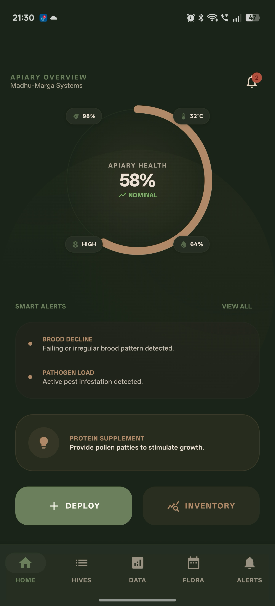
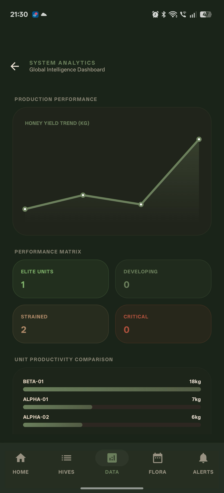
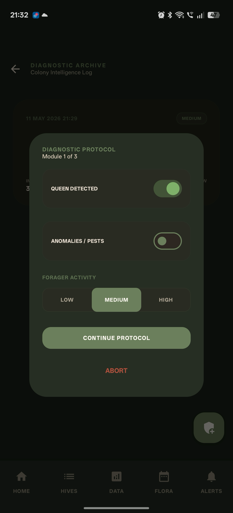
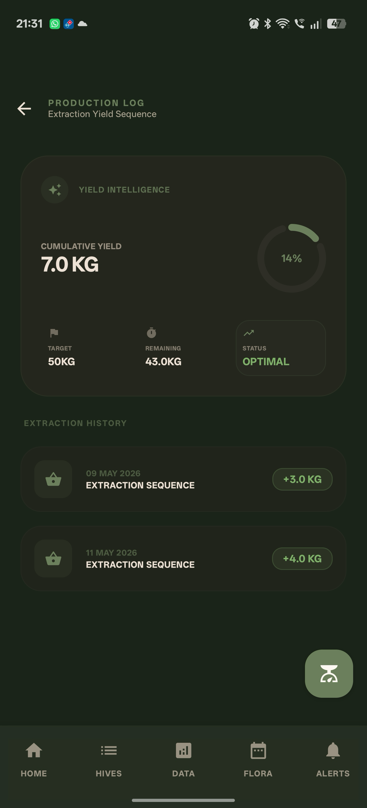
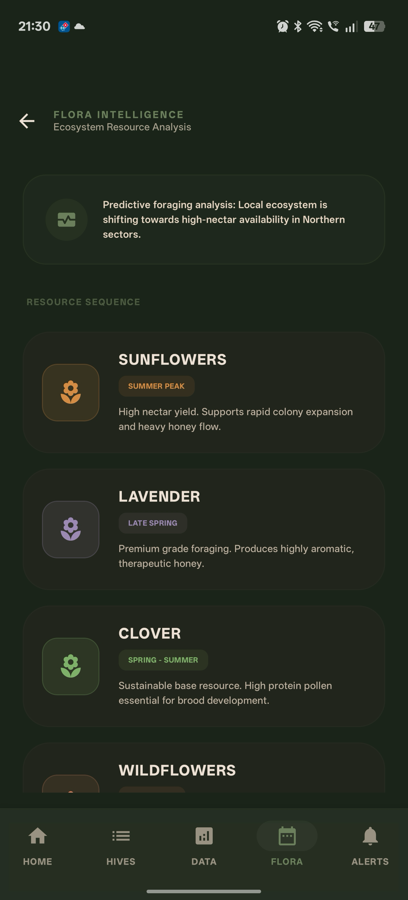
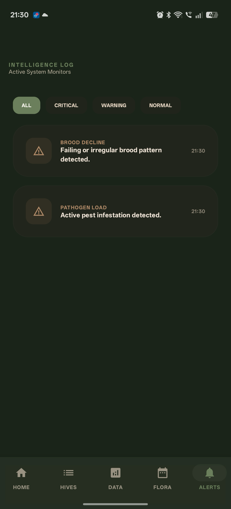
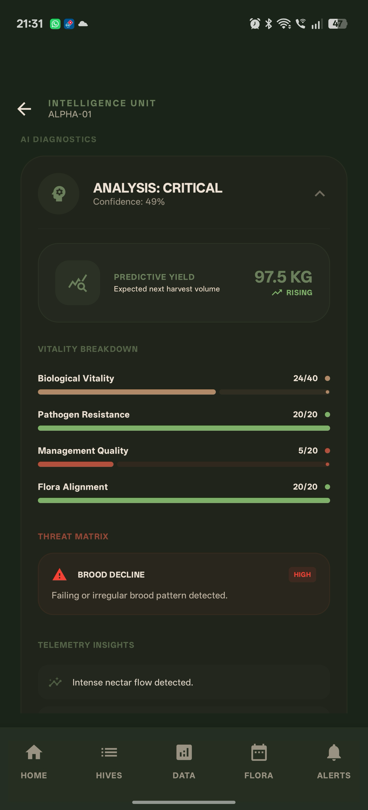

# Madhu-Marga 🐝  
## AI-Powered Smart Beekeeping Management App

Madhu-Marga (*Sanskrit for “The Path of Honey”*) is an intelligent Android application designed to modernize traditional beekeeping through digital hive management, AI-assisted diagnostics, and agricultural insights.

The application helps beekeepers monitor colony health, record inspections, track honey harvests, receive smart alerts, and make informed decisions for improved hive productivity and colony survival.

---

# 📖 Project Overview

Beekeeping plays a crucial role in agriculture, biodiversity, and honey production. However, traditional hive management often relies on manual records and experience-based judgment, making it difficult to detect early warning signs such as queen failure, pest infestation, or colony stress.

Madhu-Marga addresses these challenges by providing a smart digital management platform that combines structured monitoring with intelligent decision support.

The application is designed to:
- Digitize hive management workflows
- Improve colony health monitoring
- Reduce manual tracking complexity
- Assist beginner beekeepers with AI-guided recommendations
- Support data-driven beekeeping decisions

---

# 🚩 Problem Statement

Traditional beekeeping faces several operational challenges:

- Manual paper-based inspection tracking
- Difficulty identifying early signs of colony decline
- Delayed pest or disease detection
- Lack of structured historical hive data
- Poor coordination between hive activity and bloom cycles
- Limited decision support for less experienced beekeepers

Madhu-Marga solves these problems through a centralized Android-based intelligent hive management system.

---

# ✨ Core Features

## 📊 Smart Dashboard
<p align="center">

  

</p>
A modern dashboard providing a quick overview of apiary performance.

Includes:
- Total active hives
- Honey production summary
- Colony health index
- Priority alerts
- Nearby floral activity insights
- Weather display widget
- Quick action shortcuts

---

## 🏠 Hive Registration & Management
Comprehensive hive lifecycle management.

Features:
- Register new hives
- Assign hive identifiers
- Store hive location details
- View hive-specific information
- Maintain historical hive records

---

## 📝 Inspection Log System
Structured hive inspection tracking for health monitoring.

<p align="center">

  

</p>

Inspection data includes:
- Queen presence/absence
- Pest sightings
- Hive activity levels
- Temperature observations
- Hive condition notes

<p align="center">

  

</p>

---

## 🍯 Harvest Tracker
Track honey production efficiently.

<p align="center">

  

</p>

Capabilities:
- Record harvest quantities
- Maintain harvest history
- Hive-wise production tracking
- Production summaries

---

## 🌸 Flora Guide

<p align="center">

  

</p>

Seasonal floral intelligence to support better beekeeping decisions.

Features:
- Bloom activity information
- Seasonal flower references
- Nectar source guidance
- Region-based floral insights

---

## 🚨 Smart Alert Center

<p align="center">

  

</p>

Intelligent alerting system for hive management risks.

Alerts include:
- Missing queen detection
- Low activity warnings
- Colony health alerts
- Inspection reminders
- Intervention notifications

---

## 🩺 AI Hive Doctor
AI-assisted hive diagnosis engine for intelligent recommendations.

Analyzes:
- Queen status
- Pest detection
- Honey flow condition
- Colony activity
- Temperature observations
- Hive condition indicators

Generates:
- Hive health score
- Risk assessment
- Diagnosis summary
- Action recommendations
- Critical alerts

Sample recommendations:
- Inspect for queen replacement
- Check for mite infestation
- Improve hive ventilation
- Provide supplemental feeding
- Prepare for honey harvest

---

# 🧠 AI Hive Doctor – Intelligent Diagnostic Engine

<p align="center">

  

</p>

The AI Hive Doctor functions as a rule-based decision support system that simulates expert beekeeping reasoning.

### Input Parameters
- Queen presence
- Pest observations
- Honey flow condition
- Activity level
- Temperature condition
- Hive behavior indicators

### Processing Logic
The engine evaluates hive conditions using heuristic decision logic and risk classification.

### Output
The system provides:
- Colony Health Score (0–100%)
- Risk Level Classification
- Diagnosis Explanation
- Recommended Corrective Actions
- Emergency Alerts

Example diagnoses:
- Possible queen failure
- Pest infestation risk
- Heat stress warning
- Nutritional deficiency
- Harvest readiness

---

# 🛠 Technology Stack

### Development
- Kotlin
- Android Studio

### UI
- Jetpack Compose
- Material 3 Design System

### Architecture
- MVVM (Model-View-ViewModel)

### Database
- Room Persistence Library (SQLite)

### Async Processing
- Kotlin Coroutines
- Kotlin Flow

### Navigation
- Jetpack Compose Navigation

---

# 🏗 Architecture

Madhu-Marga follows the MVVM architectural pattern to ensure clean separation of concerns and maintainability.

### Layers

**Presentation Layer**
- Jetpack Compose UI screens
- Theme components
- Navigation management

**ViewModel Layer**
- State management
- UI logic coordination
- Data communication

**Repository Layer**
- Data access abstraction
- Database interaction

**Logic Layer**
- AI Hive Doctor engine
- Diagnostic processing
- Alert decision logic

**Persistence Layer**
- Room Database
- Local offline storage

---

# 📁 Project Structure

```text
app/
 ┣ src/main/java/com/example/madhu_marga_2/
 ┃ ┣ data/
 ┃ ┃ ┣ Models.kt
 ┃ ┃ ┣ AppDatabase.kt
 ┃ ┃ ┗ HiveRepository.kt
 ┃ ┣ logic/
 ┃ ┃ ┗ HiveIntelligence.kt
 ┃ ┣ ui/
 ┃ ┃ ┣ screens/
 ┃ ┃ ┗ theme/
 ┃ ┣ viewmodel/
 ┃ ┃ ┗ HiveViewModel.kt
 ┃ ┗ MainActivity.kt
